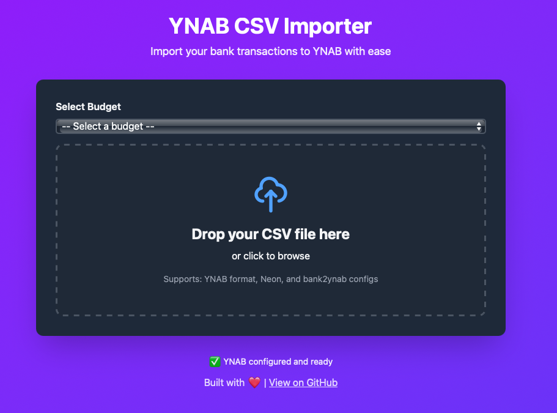

# QuickYNAB

[](https://github.com/maiis/quickynab/actions/workflows/test.yml)
[](https://libraries.io/github/maiis/quickynab)
[](https://www.npmjs.com/package/quickynab)
[](https://www.npmjs.com/package/quickynab)
[](https://hub.docker.com/r/maiis/quickynab)
[](https://hub.docker.com/r/maiis/quickynab)
[](https://github.com/maiis/quickynab)
[](https://opensource.org/licenses/MIT)

Self-hosted app to import bank transactions to YNAB. Supports 116+ banks worldwide with drag-and-drop web interface and CLI.



## Features

- 🏠 **Self-Hosted** - Run on your own machine, your data never leaves your control
- 🔒 **Privacy-Friendly** - No data collection, no tracking, no external servers
- 🌐 **Web App** - Drag-and-drop interface with transaction preview
- 💻 **CLI** - Command-line tool for automation
- 🏦 **116+ Banks** - Auto-detects format from 25+ countries ([bank2ynab](https://github.com/bank2ynab/bank2ynab))
- ✨ **Smart Imports** - Prevents duplicates automatically

## Quick Start

### Docker (Easiest)

**Quick Start:**

```bash
docker run -d \
  -p 3000:3000 \
  -e YNAB_ACCESS_TOKEN=your_token \
  maiis/quickynab:latest
```

**Docker Compose:**

```yaml
services:
  quickynab:
    image: maiis/quickynab:latest
    ports:
      - "3000:3000"
    environment:
      - YNAB_ACCESS_TOKEN=your_token
      - YNAB_BUDGET_ID=optional_budget_id
      - YNAB_ACCOUNT_ID=optional_account_id
    restart: unless-stopped
```

Then open http://localhost:3000

### NPM

```bash
npm install -g quickynab
ynab init
ynab import statement.csv

# Preview transactions without uploading
ynab import statement.csv --dry-run
```

## Configuration

Get your YNAB token from https://app.ynab.com/settings/developer

**Docker/Web App:** Set environment variables:

- `YNAB_ACCESS_TOKEN` (required)
- `YNAB_BUDGET_ID` (optional - preselects budget)
- `YNAB_ACCOUNT_ID` (optional - preselects account)

**CLI:** Run `ynab init` (saves to `~/.quickynab/config`)

- Automatically uses configured budget/account
- Override with `--budget-id` and `--account-id` flags

## Supported Banks

Auto-detects CSV format for 116+ banks including:

- 🇨🇭 Switzerland: Neon, UBS, ZKB, SwissCard
- 🇩🇪 Germany: N26, ING-DiBa, Deutsche Bank, Sparkasse
- 🇬🇧 UK: Revolut, Barclays, HSBC, Monzo
- 🇺🇸 US: Chase, Bank of America, Wells Fargo

[Full list](https://github.com/bank2ynab/bank2ynab/blob/master/bank2ynab.conf)

## CLI vs Web App

**Use Web App if:** You want a visual interface, occasional imports, select account per import

**Use CLI if:** You want automation, batch processing, cron jobs, scripting

## Development

```bash
git clone https://github.com/maiis/quickynab
cd quickynab
npm install
npm run build
npm run web  # Start web server
```

## License

MIT
